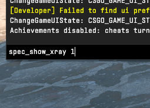
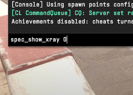
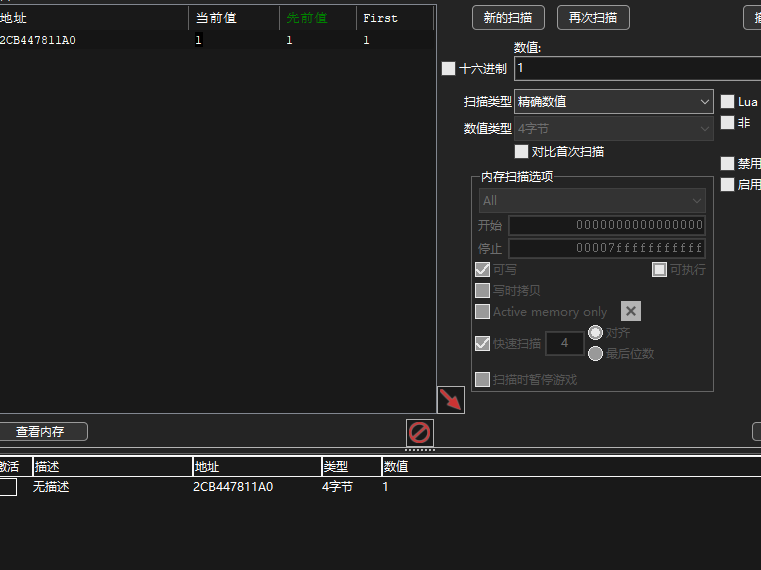
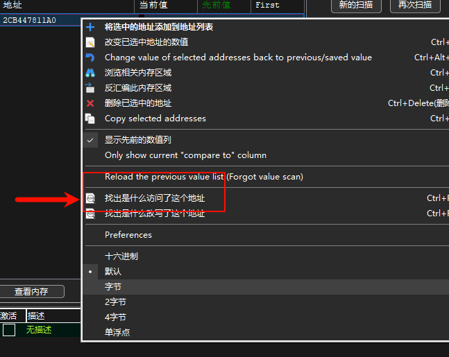
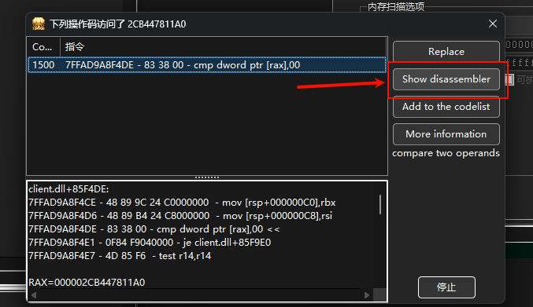
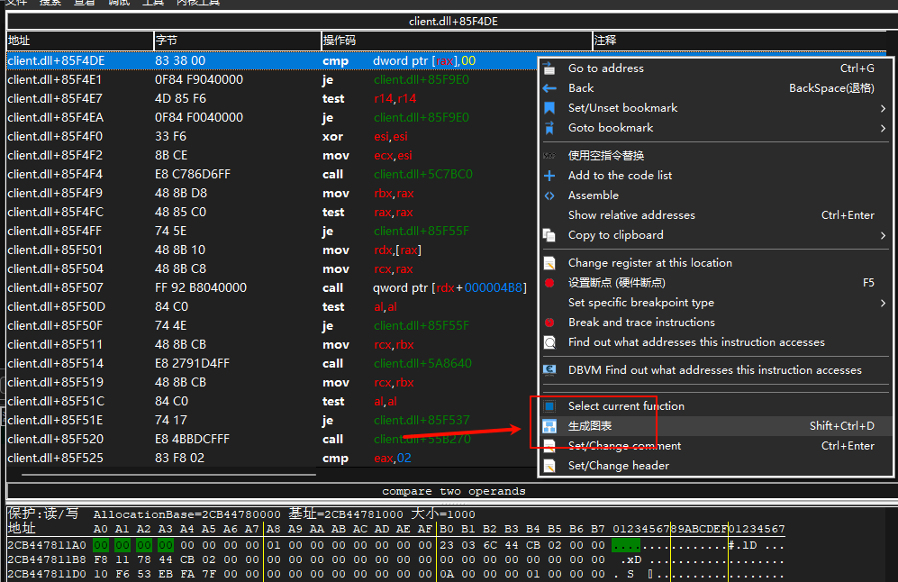
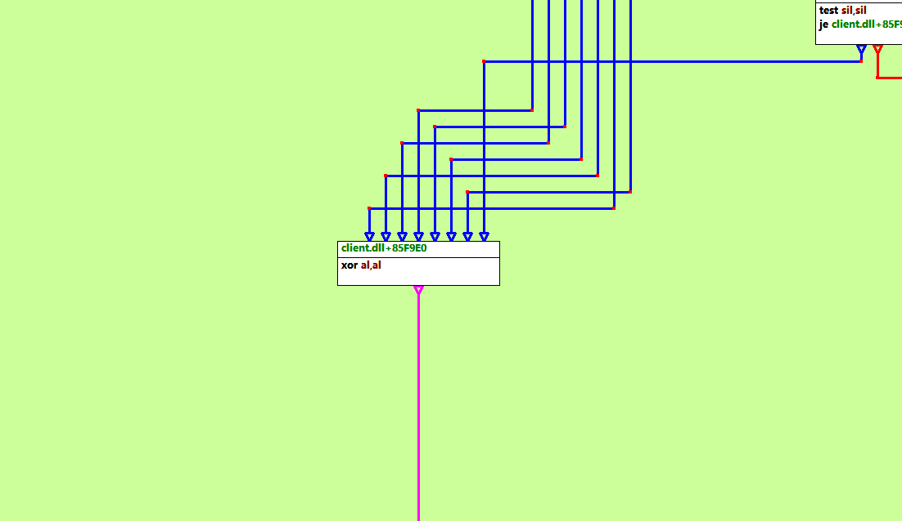
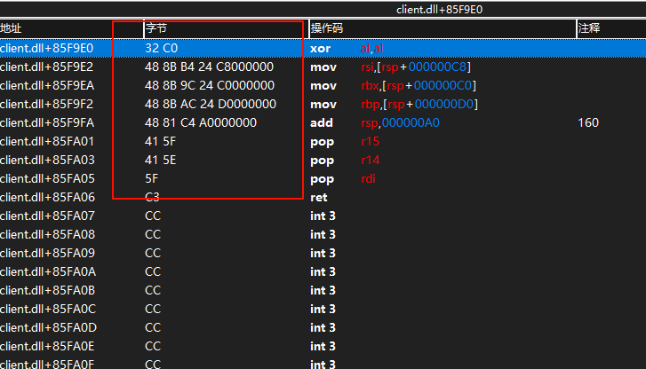

# cs2Xray

**Language**: [English](#) | [中文(简体)](README_CN.md)

## Compilation Environment
- **Compiler**: Visual Studio 2022
- **Platform**: x64 Release

## Feature Code (Signature)
**Procedure**: Launch `xray.exe`, then press F3. A Notepad window will appear. Paste or enter the following hexadecimal signature pattern into the window: 
`32 C0 48 8B B4 24 ?? 00 00 00 48 8B 9C 24 ?? 00 00 00 48 8B AC 24 ?? 00 00 00 48 81 C4 ?? 00 00 00 41 5F 41 5E 5F`

## Updating an Expired or Invalid Signature

If the signature has expired or is invalid, you can update it using the steps below.

### Prerequisites
- **Tool**: Cheat Engine (ensure compatibility with CS2’s x64 architecture)
- **Environment**: Launch CS2 and ensure the game is in an operational state

### 1. Enable the `spec_show_xray` Feature
1. Start CS2 and enter a game.
2. Open the console (default key: `~`) and enter the following command to enable the wallhack effect:

   ```bash
   spec_show_xray 1
   ```
   Result:

   
3. To disable the effect, enter:

   ```bash
   spec_show_xray 0
   ```
   Result:

   

### 2. Locate the Target Address with Cheat Engine
1. Open Cheat Engine, click “Select Process,” and attach to the CS2 process.
2. In Cheat Engine, set the search type to “Exact Value” and data type to “4 Bytes.”
3. Enter the value `1` (corresponding to `spec_show_xray 1`) and click “First Scan.”
4. Return to the game, enter `spec_show_xray 0`, then search for the value `0` in Cheat Engine.
5. Repeat steps 3 and 4, alternating between `spec_show_xray 1` and `0`, and searching for `1` and `0` in Cheat Engine until a single target address is isolated:

   

### 3. Analyze Instructions Accessing the Target Address
1. In Cheat Engine’s address list, select the target address, right-click, and choose “Find out what accesses this address”:

   
2. Switch back to the game and trigger the `spec_show_xray` command to capture instructions accessing the address.
3. In Cheat Engine’s debug window, select a relevant instruction and click “Show Disassembler”:

   

### 4. Generate a Call Graph and Locate the Signature
1. In the disassembler window, right-click and select “Generate Graph” to visualize the instruction call hierarchy:

   
2. Once the graph is generated, review the call hierarchy:

   
3. Scroll to the bottom of the graph to locate the key instruction region:

   
4. Left-click the instruction to jump to the disassembler window. The signature is in the red highlighted area:

   

By following these steps, you can successfully locate the signature for the `spec_show_xray` feature in CS2.