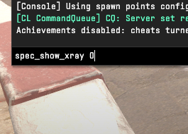
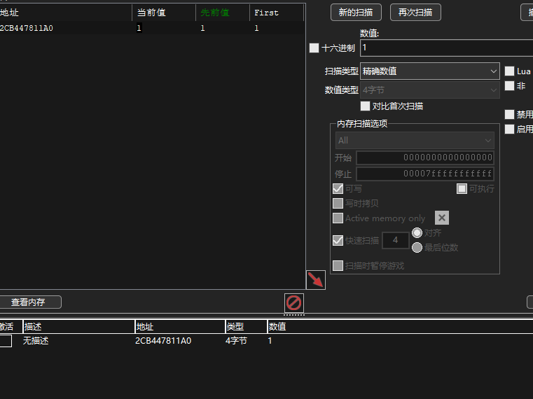
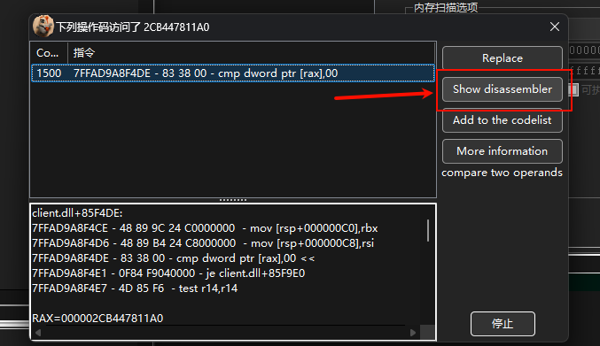
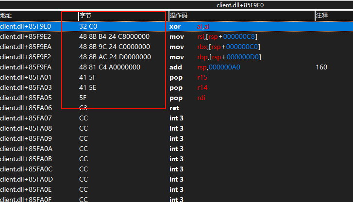

# cs2Xray

**语言**: [English](README.md) | [中文(简体)](#)

## 编译环境
- **编译器**: Visual Studio 2022
- **版本**: x64 Release

## 特征码
- **操作步骤**：运行 `xray.exe`，按下 F3 键，系统将弹出一个记事本窗口。在其中填入以下十六进制特征码:
```text
32 C0 48 8B B4 24 ?? 00 00 00 48 8B 9C 24 ?? 00 00 00 48 8B AC 24 ?? 00 00 00 48 81 C4 ?? 00 00 00 41 5F 41 5E 5F
```
## 如果特征码过期无效，可以通过下面方法更新

### 准备工作
- **工具**: Cheat Engine（确保与 CS2 的 x64 架构兼容）
- **环境**: 运行 CS2 并确保游戏处于可操作状态

### 1. 启用 `spec_show_xray` 功能
1. 启动 CS2 并进入游戏。
2. 打开游戏控制台（默认按 `~` 键），输入以下命令以启用透视效果：
   
   ```bash
   spec_show_xray 1
   ```
   效果如图：
   
   
4. 关闭透视效果，输入：
   ```bash
   spec_show_xray 0
   ```
   效果如图：
   
   

### 2. 使用 Cheat Engine 定位目标地址
1. 打开 Cheat Engine，点击“选择进程”并附加到 CS2 进程。
2. 在 Cheat Engine 中，设置搜索类型为“精确值”，数据类型为“4 字节”。
3. 输入值 `1`（对应 `spec_show_xray 1` 状态），点击“首次扫描”。
4. 返回游戏，输入 `spec_show_xray 0`，然后在 Cheat Engine 中搜索值 `0`。
5. 重复步骤 3 和 4，交替输入 `spec_show_xray 1` 和 `0`，并在 Cheat Engine 中搜索对应的值 `1` 和 `0`，直到筛选出唯一的目标地址：
   
   

### 3. 分析访问目标地址的指令
1. 在 Cheat Engine 的地址列表中，选中目标地址，右键选择“找出是什么访问了这个地址”：
   
   
2. 切换回游戏，触发 `spec_show_xray` 命令以捕获访问该地址的指令。
3. 在 Cheat Engine 的调试窗口中，选择一条相关指令，点击“显示反汇编”：
   
   

### 4. 生成调用图表并定位特征码
1. 在反汇编窗口中，右键选择“生成图表”以可视化指令的调用关系：

   
2. 图表生成后，查看调用关系图：

   
3. 滑动至图表底部，找到关键指令区域：

   
4. 左键点击该指令，跳转至反汇编窗口。特征码位于红色框选区域：

   


通过以上步骤，可成功定位 CS2 中 `spec_show_xray` 功能的特征码。