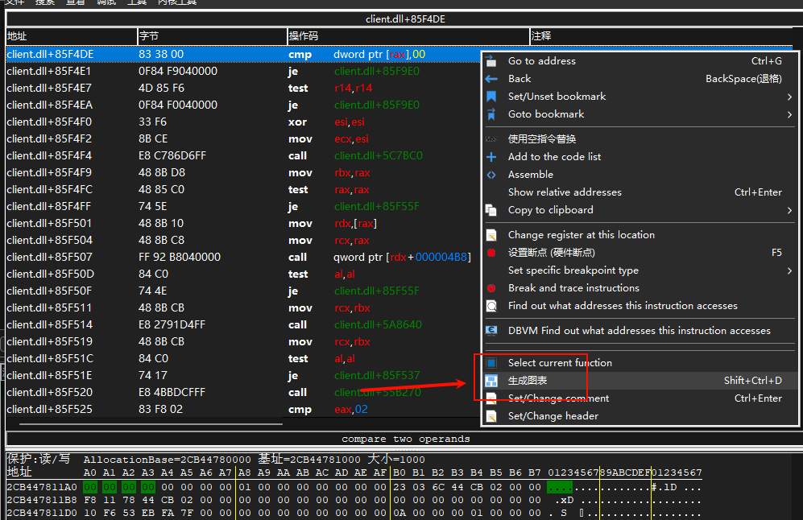
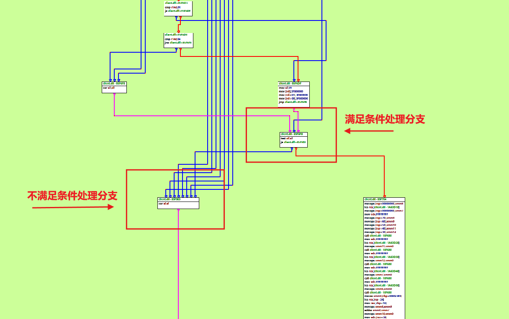
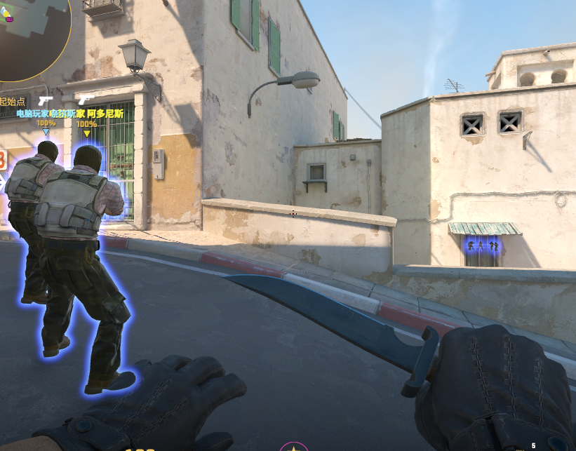

# cs2Xray

**Language**: [English](#) | [中文(简体)](README_CN.md)

## Compilation Environment
- **Compiler**: Visual Studio 2022
- **Platform**: x64 Release

## Feature Code (Signature)
**Procedure**: Launch `xray.exe`, then press F3. A Notepad window will appear. Paste or enter the following hexadecimal signature pattern into the window: 
```text
32 C0 48 8B B4 24 ?? 00 00 00 48 8B 9C 24 ?? 00 00 00 48 8B AC 24 ?? 00 00 00 48 81 C4 ?? 00 00 00 41 5F 41 5E 5F
```
## Updating an Expired or Invalid Signature

If the signature has expired or is invalid, you can update it using the steps below.

### Prerequisites
- **Tool**: Cheat Engine (ensure compatibility with CS2’s x64 architecture)
- **Environment**: Launch CS2 and ensure the game is in an operational state

### 1. Enable the `spec_show_xray` Feature
1. Start CS2 and enter a game.
2. Open the console (default key: `~`) and enter the following command to enable the wallhack effect:

   ```bash
   spec_show_xray 1
   ```
   Result:

   
3. To disable the effect, enter:

   ```bash
   spec_show_xray 0
   ```
   Result:

   

### 2. Locate the Target Address with Cheat Engine
1. Open Cheat Engine, click “Select Process,” and attach to the CS2 process.
2. In Cheat Engine, set the search type to “Exact Value” and data type to “4 Bytes.”
3. Enter the value `1` (corresponding to `spec_show_xray 1`) and click “First Scan.”
4. Return to the game, enter `spec_show_xray 0`, then search for the value `0` in Cheat Engine.
5. Repeat steps 3 and 4, alternating between `spec_show_xray 1` and `0`, and searching for `1` and `0` in Cheat Engine until a single target address is isolated:

   

### 3. Analyze Instructions Accessing the Target Address
1. In Cheat Engine’s address list, select the target address, right-click, and choose “Find out what accesses this address”:

   
2. Switch back to the game and trigger the `spec_show_xray` command to capture instructions accessing the address.
3. In Cheat Engine’s debug window, select a relevant instruction and click “Show Disassembler”:

   

### 4. Generate Call Graph and Extract Feature Code

1. In the disassembly window, right-click and select "Generate Graph" to visualize the call relationships of the instructions:

   

2. Examine the generated call graph to analyze the logic of the `spec_show_xray`-related function (referred to as `init_xray` below):

   

3. **Objective**: Enable the wallhack effect for all players. The `init_xray` function determines whether an entity glows, based on factors such as:

   - The value of `spec_show_xray` (1 or 0)
   - Whether the local player is dead
   - Whether the entity is a teammate or a corpse

4. **Code Logic Assumptions**:

   - The function is designed with low coupling, clear logic, and early returns where possible.
   - It iterates through all entities, evaluating each one for glow eligibility.
   - The logical flow is as follows:

   ```mermaid
   graph TD;
       E[Iterate through each entity] --> A[Enter init_xray function]
       A --> B{Evaluate glow conditions}
       B -->|Met| C[Set glow parameters （color， brightness，etc.）<br>Set glow flag to true or keep true]
       B -->|Not met| D[Set glow flag to false or keep false]
       C --> F[Cleanup processing]
       D --> F
       F --> G[Exit init_xray, invoke glow SDK]
   ```

5. **Feature Code Identification Process**:

   - **Observation**: Most entities (e.g., enemies) fail to meet glow conditions, leading to the "set glow flag to false" branch. Entities meeting the conditions (e.g., teammates) are fewer, leading to the "set glow flag to true" branch.
   - **Hypothesis**: In the call graph, the "not met" branch has multiple code paths, while the "met" branch has fewer. The goal is to modify instructions to redirect the "not met" branch to the "met" branch, enabling glow for all entities.
   - **Verification**: Locate the critical structure controlling the glow flag at the bottom of the call graph:

     

   - **Debugging**: Set breakpoints at key instructions to analyze the "not met" branch behavior. Identify the instruction controlling the glow flag:

     ```assembly
     xor al, al
     ```

     Replacing it with `nop` results in all entities glowing, confirming that the glow flag defaults to true and is set to false when conditions are not met.

     

   - **Locating Feature Code**: Navigate to the key instruction region in the disassembly window. The feature code is in the red-boxed area:

     

6. **Summary**:

   - Using the call graph and breakpoint debugging, identify the core instruction in `init_xray` controlling the glow effect.
   - Replace `xor al, al` with `nop` to enable glow for all entities.
   - Extract the feature code from the disassembly window to update the wallhack functionality in `xray.exe`.

By following these steps, you can successfully locate and update the feature code for the `spec_show_xray` function in CS2.