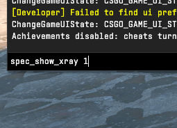
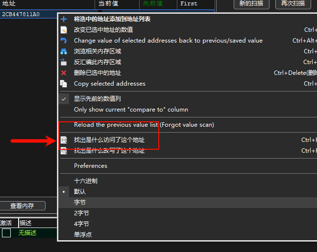
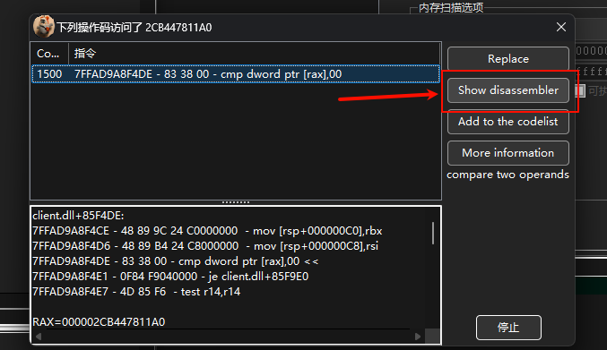
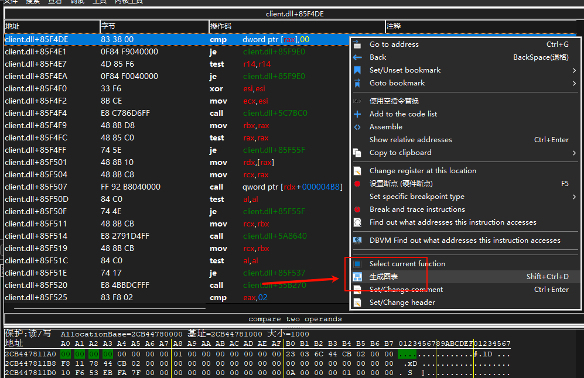
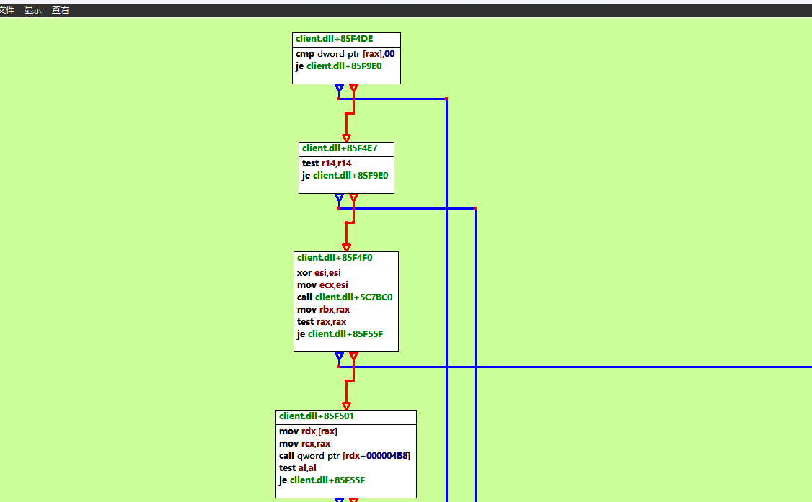
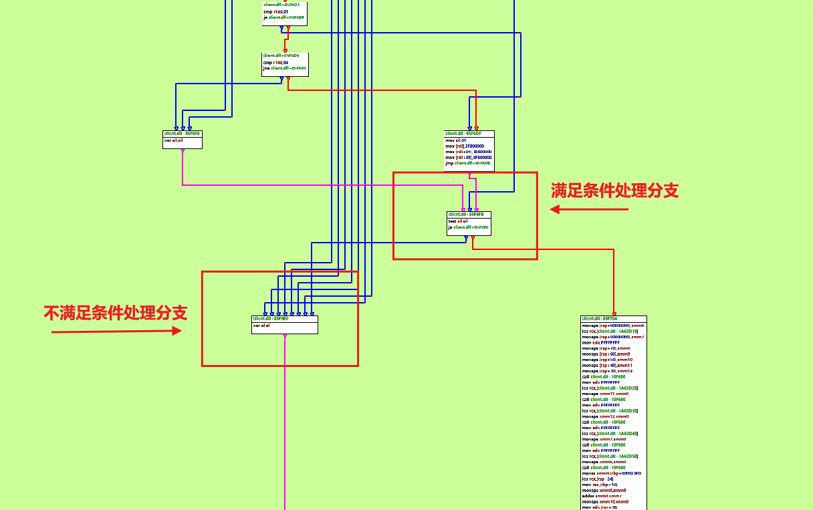
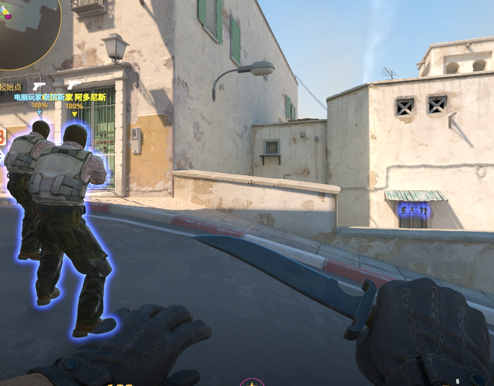
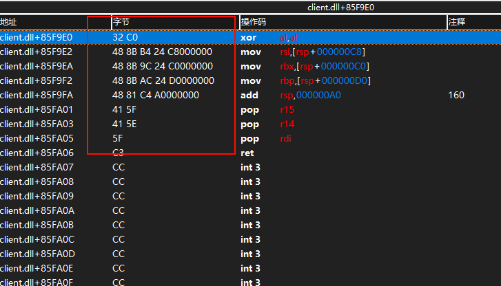

# cs2Xray

**语言**: [English](README.md) | [中文(简体)](#)

## 编译环境
- **编译器**: Visual Studio 2022
- **版本**: x64 Release

## 特征码
- **操作步骤**：运行 `xray.exe`，按下 F3 键，系统将弹出一个记事本窗口。在其中填入以下十六进制特征码:
```text
32 C0 48 8B B4 24 ?? 00 00 00 48 8B 9C 24 ?? 00 00 00 48 8B AC 24 ?? 00 00 00 48 81 C4 ?? 00 00 00 41 5F 41 5E 5F
```
## 如果特征码过期无效，可以通过下面方法更新

### 准备工作
- **工具**: Cheat Engine（确保与 CS2 的 x64 架构兼容）
- **环境**: 运行 CS2 并确保游戏处于可操作状态

### 1. 启用 `spec_show_xray` 功能
1. 启动 CS2 并进入游戏。
2. 打开游戏控制台（默认按 `~` 键），输入以下命令以启用透视效果：
   
   ```bash
   spec_show_xray 1
   ```
   效果如图：
   
   
4. 关闭透视效果，输入：
   ```bash
   spec_show_xray 0
   ```
   效果如图：
   
   

### 2. 使用 Cheat Engine 定位目标地址
1. 打开 Cheat Engine，点击“选择进程”并附加到 CS2 进程。
2. 在 Cheat Engine 中，设置搜索类型为“精确值”，数据类型为“4 字节”。
3. 输入值 `1`（对应 `spec_show_xray 1` 状态），点击“首次扫描”。
4. 返回游戏，输入 `spec_show_xray 0`，然后在 Cheat Engine 中搜索值 `0`。
5. 重复步骤 3 和 4，交替输入 `spec_show_xray 1` 和 `0`，并在 Cheat Engine 中搜索对应的值 `1` 和 `0`，直到筛选出唯一的目标地址：
   
   

### 3. 分析访问目标地址的指令
1. 在 Cheat Engine 的地址列表中，选中目标地址，右键选择“找出是什么访问了这个地址”：
   
   
2. 切换回游戏，触发 `spec_show_xray` 命令以捕获访问该地址的指令。
3. 在 Cheat Engine 的调试窗口中，选择一条相关指令，点击“显示反汇编”：
   
   

### 4. 生成调用关系图并提取特征码

1. 在反汇编窗口中，右键选择“生成图表”，以可视化指令的调用关系：

   

2. 查看生成的调用关系图，分析 `spec_show_xray` 相关函数（以下称为 `init_xray`）的逻辑：

   

3. **分析目标**：实现对所有玩家的透视效果。`init_xray` 函数控制实体是否发光，影响因素包括：

   - `spec_show_xray` 的值（1 或 0）
   - 本地玩家是否死亡
   - 实体是否为队友或尸体

4. **代码逻辑假设**：

   - 函数采用低耦合设计，逻辑清晰，尽早判断并返回。
   - 遍历所有实体，逐一判断是否满足发光条件。
   - 逻辑流程如下：

   ```mermaid
   graph TD;
       E[遍历每个实体] --> A[进入 init_xray 函数]
       A --> B{判断是否满足发光条件}
       B -->|满足| C[设置发光参数（颜色、亮度等）<br>发光标识位设为 true 或保持 true]
       B -->|不满足| D[发光标识位设为 false 或保持 false]
       C --> F[收尾处理]
       D --> F
       F --> G[退出 init_xray，调用发光 SDK]
   ```

5. **特征码定位思路**：

   - **观察**：大多数实体（如敌人）不满足发光条件，导向“发光标识位设为 false”分支；满足条件的（如队友）较少，导向“发光标识位设为 true”分支。
   - **猜想**：调用图表中，“不满足条件”分支的代码路径较多，而“满足条件”分支的路径较少。目标是通过修改指令，将“不满足条件”分支改为“满足条件”，使所有实体发光。
   - **验证**：在调用图表中定位底部区域，找到控制发光标识位的关键结构：

     

   - **调试**：通过在关键指令处设置断点，分析“不满足条件”分支的行为。发现以下指令控制发光标识位：

     ```assembly
     xor al, al
     ```

     将其修改为 `nop` 后，所有实体成功发光，确认默认状态下发光标识位为 true，不满足条件时被置为 false。

     

   - **定位特征码**：滑动至关键指令区域，查看反汇编窗口，特征码位于红色框选区域：

     


通过以上步骤，可成功定位并更新 CS2 中 `spec_show_xray` 功能的特征码。 